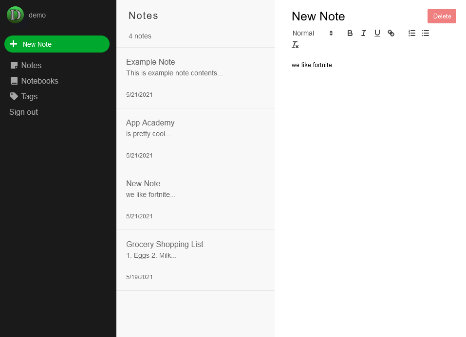
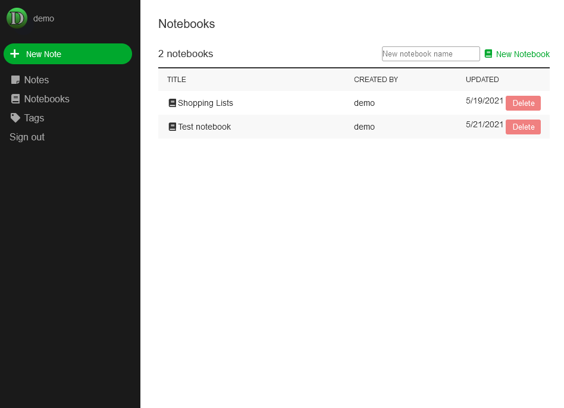

# Levernote

Levernote is a clone of Evernote, a popular note taking web app. Levernote allows you to leverage the power of notes, and then organize your notes into collections called notebooks.

[Levernote](https://levernote.herokuapp.com/)

Notes            |  Notebooks
:-------------------------:|:-------------------------:
 | 

## Deployment

Initialize the database with `rails db:reset`. You must be running PostgreSQL.

Start the server with `rails s`

Compile the javascript with `npm run webpack`

Navigate your broswer to `localhost:3000`

## Techologies Used

Levernote is built with PostgreSQL, Rails, React, and Redux

PostgreSQL is used to store the users, notes, and notebooks in a database. 

Rails is used to create an API interface for the back end. Rails performs SQL queries and outputs data from the database in the form of JSON objects.

React is used to create a front-end for the information output by the API. Thunk actions perform API calls and then send the response to a Reducer which populates the Redux store. Then the React components use information from the store, such as the current user or some subset of notes, to present information.

## Features

### Notes

Notes are a table in the database with columns for title, body, notebook_id, and author_id.

Users are able to create, view, update, and delete notes.

Users see their notes after logging in and clicking Notes on the left sidebar. This will then display a notes list where the user can pick a note to view.

A challenging aspect of implementing the notes feature was creating a way to edit them. This was done by implementing a rich text editor library called React-Quill, and synchronizing the value of that component with the state of its container component. Then the database was updated based on the state change.

```Javascript

class NotesList extends React.Component {
    constructor(props) {
        super(props);
    }

    componentDidMount() {
        
    }

    render() {
        let notes = Object.values(this.props.notes).reverse();
        
        return(
            <ul className="notes-index-list">
                {notes.map(note => (
                    <NotesIndexItem note={note} key={note.id} url={this.props.url} />
                ))}
            </ul>
        )
    }
}
```

### Notebooks

Notebooks are a table in the database with columns for name and author_id. They have many notes through database associations.

Users are able to create, view, and delete notebooks.

Userse see their notebooks after logging in and clicking Notebooks on the left sidebar. This will then display a list of notebooks where the user can pick a notebook. Selecting a notebook then displays a list of the notes in that notebook utilizing components built for the Notes feature.

Implementing Notebooks required figuring out how to reuse existing components for new functionality. This was mostly done by wrapping them in new Redux Container components, and then utilizing the react router to use these new containers based on the url. It required some work to make the existing components fit a more general case.

```Javascript
import { connect } from 'react-redux';
import NotesIndex from '../notes_index/notes_index';

const mapStateToProps = (state, ownProps) => {
    let notebook = state.entities.notebooks[ownProps.match.params.notebookId];
    return {
        notebook: notebook,
        notes: state.entities.notes,
        url: `/notebooks/${ownProps.match.params.notebookId}/notes/`,
        notebookName: notebook.name,
    }
}

const mapDispatchToProps = (dispatch, ownProps) => {
    return {
        fetchNotes: () => dispatch(fetchNotebook(ownProps.match.params.notebookId)),
    }
}

export default connect(mapStateToProps, mapDispatchToProps)(NotesIndex);
```

### Tags

Tags are a table in the database with columns for name and author_id. They have many notes through a join table of NoteTags.

Users are able to create, view, rename, and delete tags. Users can add tags to notes. Users can use tags to filter through their notes, either by one tag at a time or combinations of tags. 

Users see thier tags after logging in and clicking Tags on the left sidebar. This displays a list of the users tags. Users can create tags here. Tags can also be created when viewing a note in the tag section of that note.

Implementing Tags required more complex database code than the previously existing features, as it necessitated the use of a join table. It also involved a lot of modifications to existing components to incorporate the tags. Both the notes index and the individual note components contain new interactive elements related to tags, such as filtering the list of tags, or adding/removing tags from the note.

## Future

Implement search feature to allow users to filter notes based on a string.

Implement note templates to give users preset suggestions for different kinds of notes.


